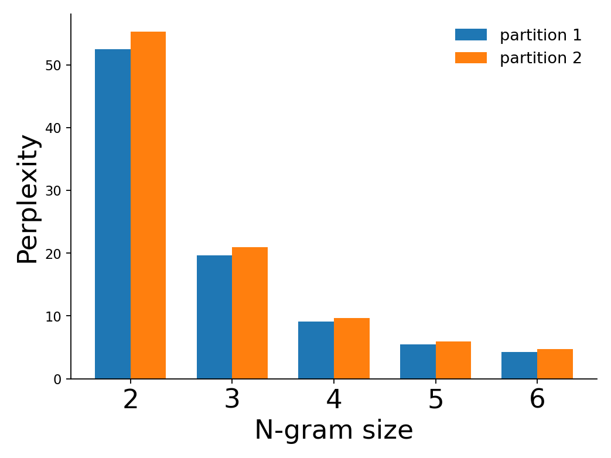

# ChildesNgrams


## About

This repository contains research code for exploring n-gram statistics of a `spacy`-tokenized corpus of 5M words of child-directed speech.

The primary aim is to produce visualisations that demonstrate that the statistical structure of speech to younger children is less complex compared to that of older children (1-3 vs. 3-6 years). 
For example, an n-gram model trained on the first half of the (age-ordered) corpus, consistently performs worse when evaluated on the same corpus:

<div align="center">
  
</div>

## Dependencies

To install `kenlm`, 

```bash
pip install https://github.com/kpu/kenlm/archive/master.zip
```
User may need to install additional binaries, and update 

* `scripts.LMPLZ_PATH`
* `scripts.BINARIZE_PATH`

## Compatibility 

Developed with Python 3.7 on Ubuntu 18.04
